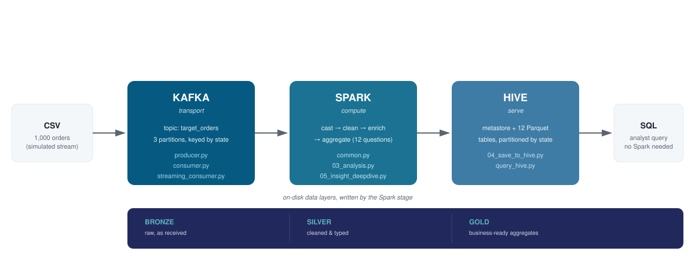
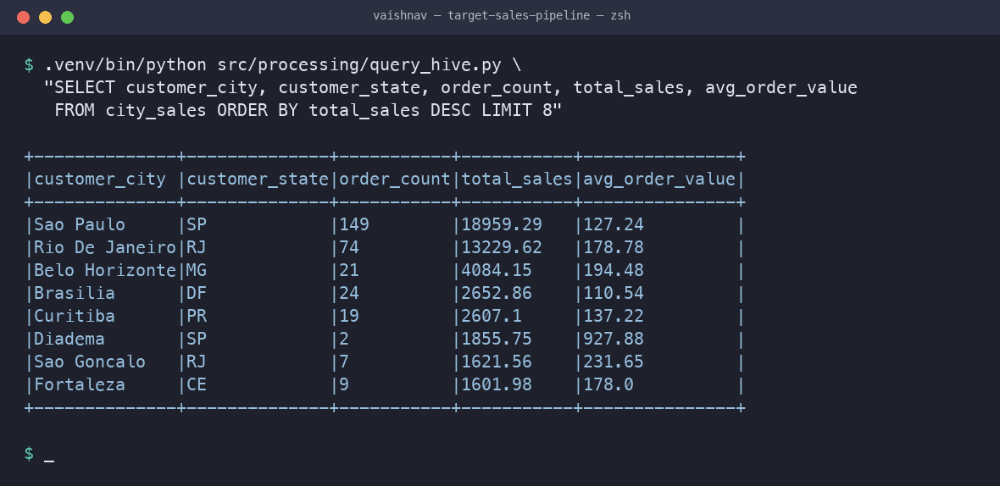

# Target Sales Data Pipeline — Kafka → PySpark → Hive

[](https://github.com/<your-github-username>/target-sales-pipeline/actions/workflows/ci.yml)
[](LICENSE)
[](requirements.txt)
[](docker-compose.yml)

A working end-to-end data pipeline that ingests retail sales transactions through
Kafka, processes them with PySpark, and publishes analytics tables to a Hive
metastore where they can be queried with plain SQL — plus a Streamlit dashboard
over the results and a full write-up of every design decision, bug, and honest
null finding along the way.



---

## Quick start — one command, no local installs

```bash
docker compose up --build
```

This starts a single-node Kafka broker (KRaft mode) and a container that runs
the entire pipeline against it — producer, consumer, EDA, business analysis,
and Hive registration — with no local Java, Python, Spark, or Kafka install
required. It was verified end to end while building this repo (Kafka up
healthy, all 12 tables registered, exit code 0). Ctrl-C or `docker compose down`
to stop it; Hive's warehouse and gold tables land in `output/` on the host via
a bind mount, so they survive after the containers exit.

Then query the results from inside the running container:

```bash
docker compose exec pipeline python3 src/processing/query_hive.py
```

...or view them in the dashboard (see [below](#dashboard)).

### Running natively instead (no Docker)

```bash
python3 -m venv .venv && .venv/bin/pip install -r requirements.txt
brew install kafka && brew services start kafka   # Java 17/21 required (Spark runs on the JVM)
./run_pipeline.sh                                  # or --no-kafka for Spark + Hive only
.venv/bin/python src/processing/query_hive.py
```

---

## The architecture

```
data/target_orders.csv
        │
        │  producer.py  (simulates a live event source)
        ▼
   ┌─────────────────────────────────┐
   │  KAFKA  topic: target_orders    │   TRANSPORT
   │  3 partitions, keyed by state   │   durable, replayable buffer
   └─────────────────────────────────┘
        │                        │
        │ consumer.py            │ streaming_consumer.py
        │ (batch, simple)        │ (Structured Streaming, production)
        ▼                        ▼
   ┌─────────────────────────────────┐
   │  PYSPARK                        │   COMPUTE
   │  cast → clean → enrich → agg    │   distributed processing
   └─────────────────────────────────┘
        │
        ▼
   ┌─────────────────────────────────┐
   │  BRONZE  raw as received        │
   │  SILVER  cleaned + typed        │   MEDALLION LAYERS
   │  GOLD    business aggregates    │
   └─────────────────────────────────┘
        │
        │  saveAsTable()
        ▼
   ┌─────────────────────────────────┐
   │  HIVE METASTORE                 │   SERVE
   │  12 tables, Parquet, partitioned│   analysts write SQL
   └─────────────────────────────────┘
```

**Medallion architecture** — the bronze/silver/gold split is the standard
lakehouse pattern. Bronze is the immutable record of exactly what arrived
(never edit it; it is your ability to rebuild everything). Silver is cleaned
and typed. Gold is business-ready aggregates. Each layer is rebuildable from
the one above it.

---

## Dashboard

```bash
.venv/bin/streamlit run dashboard.py
```

A read-only Streamlit page over the gold Parquet tables — top cities by
revenue, review score distribution, and the delivery-time-vs-review-score
chart behind the headline finding below. It's pandas + Plotly, deliberately
not Spark: by the time results reach here they're a few hundred aggregated
rows, and using Spark to serve a dashboard would be the wrong tool for the
size of the job.

```
$ .venv/bin/python src/processing/query_hive.py \
  "SELECT customer_city, customer_state, order_count, total_sales, avg_order_value
   FROM city_sales ORDER BY total_sales DESC LIMIT 8"
```



---

## This isn't as simple as it looks — proof, not just claims

Everything below is something the pipeline actually demonstrates, with a
file/line you can go check, not just a term dropped for effect.

| Concept | Where it's proven in this repo |
|---|---|
| **Exactly-once stream processing** | `streaming_consumer.py` uses Spark checkpointing; verified by running it twice — the second run processed **zero** new rows and bronze stayed at exactly 1,000, not 2,000 (see [Bugs hit](#bugs-hit-while-building-this-and-what-they-teach)) |
| **ANSI-mode strict casting** | The `NaN`→`"nan"`→crashed `TIMESTAMP` cast bug below is a real Spark 4 ANSI-mode failure, not a hypothetical — fixed with `try_cast` plus source-side normalization |
| **Partition pruning** | `04_save_to_hive.py`'s `EXPLAIN` output shows `PartitionFilters` and a `Location` naming exactly one of 26 state directories — Spark provably skips the other 25 |
| **Data skew, measured** | Keying Kafka messages by `customer_state` produced a measured 213/668/119 split across 3 partitions (SP is 42% of orders) — an empirical finding, not a textbook mention |
| **Statistical power, not just a correlation number** | The null-result section computes that `\|r\|` must exceed ~0.063 at n=978 to mean anything, and checks the finding three independent ways (bucketed averages, tail effect, sample size) before accepting it |
| **Mean vs. median under skew** | Approval time: mean 10.4 hours vs. median 21 minutes — reported both, because reporting only the mean here would misrepresent the typical case |
| **Idempotent, replayable pipeline** | Every write uses `mode("overwrite")`; Kafka retention plus `auto_offset_reset=earliest` means the whole pipeline can be re-run from scratch and reach the same end state |
| **Schema as a contract, not a convenience** | Explicit `StructType` for all 12 columns, deliberately typing `customer_zip_code_prefix` as `StringType` (never do arithmetic on it) instead of the integer `inferSchema` would guess |

---

## Project layout

| Path | What it does |
|---|---|
| `src/processing/common.py` | Shared SparkSession, the authoritative schema, cleaning logic |
| `src/processing/01_explore_raw.py` | Demonstrates the schema/typing problem |
| `src/processing/02_eda.py` | All six EDA questions |
| `src/processing/02b_null_investigation.py` | Why blanket `dropna()` is wrong here |
| `src/processing/03_analysis.py` | All six processing questions → gold tables |
| `src/processing/04_save_to_hive.py` | Registers gold tables in the metastore |
| `src/processing/05_insight_deepdive.py` | Interrogates the headline correlation |
| `src/processing/query_hive.py` | Interactive SQL shell over the results |
| `src/ingestion/producer.py` | Kafka producer |
| `src/ingestion/consumer.py` | Kafka consumer (batch — the brief's literal spec) |
| `src/ingestion/streaming_consumer.py` | Structured Streaming (how it's really done) |
| `dashboard.py` | Streamlit dashboard over the gold tables |
| `tests/` | pytest unit tests for the cleaning/schema logic, run in CI |
| `docker-compose.yml`, `Dockerfile` | One-command Kafka + pipeline bring-up |

---

## Project layout

| Path | What it does |
|---|---|
| `src/processing/common.py` | Shared SparkSession, the authoritative schema, cleaning logic |
| `src/processing/01_explore_raw.py` | Demonstrates the schema/typing problem |
| `src/processing/02_eda.py` | All six EDA questions |
| `src/processing/02b_null_investigation.py` | Why blanket `dropna()` is wrong here |
| `src/processing/03_analysis.py` | All six processing questions → gold tables |
| `src/processing/04_save_to_hive.py` | Registers gold tables in the metastore |
| `src/processing/05_insight_deepdive.py` | Interrogates the headline correlation |
| `src/processing/query_hive.py` | Interactive SQL shell over the results |
| `src/ingestion/producer.py` | Kafka producer |
| `src/ingestion/consumer.py` | Kafka consumer (batch — the brief's literal spec) |
| `src/ingestion/streaming_consumer.py` | Structured Streaming (how it's really done) |

---

## Results

### EDA

| Question | Answer |
|---|---|
| Mean `order_products_value` | **127.88** |
| Mean `order_freight_value` | **21.35** |
| Mean total (products + freight) | **149.22** |
| Unique states | **26** |
| Missing values | 22 nulls, all in `order_delivered_customer_date` (2.2%) |
| Rows failing schema parse | 0 |

**Order status distribution**

| status | orders | % |
|---|---|---|
| delivered | 983 | 98.3% |
| shipped | 12 | 1.2% |
| canceled | 3 | 0.3% |
| invoiced | 1 | 0.1% |
| processing | 1 | 0.1% |

**Top 5 cities by order count:** Sao Paulo (149), Rio De Janeiro (74),
Brasilia (24), Belo Horizonte (21), Curitiba (19).

### Business analysis

**Top cities by revenue:** Sao Paulo 18,959.29 · Rio De Janeiro 13,229.62 ·
Belo Horizonte 4,084.15 · Brasilia 2,652.86 · Curitiba 2,607.10

**Correlations**

| pair | Pearson r | reading |
|---|---|---|
| freight ↔ item quantity | **0.633** | strongest — more items, heavier shipment |
| product value ↔ freight | **0.472** | moderate — pricier goods cost more to ship |
| product value ↔ item qty | **0.269** | weak — quantity is not the main revenue driver |

**Timing**

| metric | value |
|---|---|
| Avg delivery time | 12.33 days |
| **Median delivery time** | **10.18 days** ← the honest number |
| Fastest / slowest single order | 0.49 / 81.29 days |
| Avg approval time | 10.41 hours |
| **Median approval time** | **0.35 hours (21 min)** ← the honest number |

The mean/median gap is the point: both distributions are right-skewed, so the
mean overstates the typical customer's experience. Approval is the extreme
case — the typical order is approved in **21 minutes**, but a few multi-day
stragglers drag the average to 10.4 hours. Always report the median for
skewed distributions.

**Reviews** — average **4.09**, but the distribution is bimodal:
58% five-star and 11.9% one-star. The mean alone hides that one in eight
customers is actively unhappy.

**Delivery speed by city** (min 5 orders)

| Fastest | days | Slowest | days |
|---|---|---|---|
| Recife (PE) | 7.40 | Nova Iguacu (RJ) | 18.59 |
| Niteroi (RJ) | 7.85 | Barueri (SP) | 18.00 |
| Volta Redonda (RJ) | 8.39 | Itaquaquecetuba (SP) | 16.18 |

### The headline question — and an honest null result

**Delivery time vs review score: Pearson r = 0.022, Spearman ρ = 0.026.
Effectively zero.**

The expected story is "slow delivery → angry customers", so this was
investigated three ways in `05_insight_deepdive.py`:

- **Non-linear cliff?** No. Bucketing delivery into 0-3 / 4-7 / 8-14 / 15-21 /
  22-30 / 30+ days gives average reviews of 4.29 / 4.06 / 4.03 / 4.14 / 4.33 /
  3.98 — flat and non-monotonic.
- **Tail effect?** No. Orders past the 90th percentile (>22.3 days) average
  4.14 vs 4.09 for everyone else — marginally *better*.
- **Statistical power?** At n=978, |r| must exceed ~0.063 to be
  distinguishable from zero. Our 0.022 is inside the noise.

**Conclusion:** in this 1,000-row sample there is no relationship. The full
100k-row Olist dataset this was sampled from does show one; this curated
sample (98.3% delivered, 58% five-star) is too small and too skewed to
reproduce it.

The engineering takeaway matters more than the business one: **the pipeline is
validated — it computes the metric correctly. The data is insufficient to
answer the business question.** Those are two different problems, and
conflating them is how bad decisions get made from good code.

---

## Data quality findings

Real defects found in the source data. In production each of these would be a
ticket to the upstream system owner, not something silently patched.

1. **Inconsistent city casing.** `SAO PAULO` and `Sao Paulo` are distinct
   strings to a `groupBy`. Naive grouping reported Sao Paulo at **143 orders;
   the true figure is 149** — a 4% error on the headline city. Fixed by
   normalising with `initcap(lower(trim(...)))` before any aggregation.

2. **22 orders marked `delivered` with no delivery timestamp.** A
   contradiction, not missing data.

3. **3 orders marked `canceled` that carry a delivery timestamp.** The
   contradiction running the other way — and `dropna()` would not have caught
   it at all.

4. **`customer_zip_code_prefix` inferred as integer.** Wrong: a zip code is an
   identifier, never a quantity, and integer storage silently eats leading
   zeros (`01040` → `1040`). Declared as `StringType`.

5. **`order_aproved_at` is misspelled in the source.** Preserved as-is at read
   time rather than silently renamed, so the mapping stays visible.

6. **The data is not American.** States are Brazilian (SP, RJ, MG); this is the
   Olist Brazilian e-commerce dataset relabelled as Target. Any geographic
   conclusion should be framed accordingly.

---

## Engineering decisions worth defending

**Explicit schema instead of `inferSchema`.** Inference costs an extra full
pass over the data (double the I/O on 200 GB) and it *guesses* — if row
2,000,001 contains `"N/A"` in a numeric column, the job dies in production
after passing in dev. An explicit schema is a contract that fails loudly and
immediately.

**No blanket `dropna()`.** The brief says "remove null values if any." Taken
literally that deletes 2.2% of rows and hides a real upstream defect.
`avg()` already ignores nulls. The correct policy is per-metric: keep every
row for revenue and counts; filter to rows that have a delivery date for
delivery-time metrics; quarantine the contradictory records.

**Minimum-volume guards on every ranking.** A city with one order and one
1-star review is noise. Without a `>= 5 orders` filter, every "top/bottom N"
list is dominated by tiny samples.

**Cancelled orders excluded from revenue.** A cancelled order is not a sale.

**Median reported alongside mean** for both timing metrics, because both
distributions are right-skewed.

**`shuffle.partitions` set to 8.** The default is 200, tuned for terabytes. On
1,000 rows it spawns 200 near-empty tasks — pure scheduler overhead. This is
one of the most common real Spark tunings.

**Parquet, not CSV, for all outputs.** Columnar: reads only the columns you
select, compresses far better, and carries per-row-group min/max statistics so
engines can skip entire files (predicate pushdown).

**Partitioned by `customer_state`.** `EXPLAIN` on a filtered query confirms it
works — the physical plan's `Location` shows only `customer_state=SP`, so 25
directories are never touched. Note the counter-lesson: partitioning by a
high-cardinality column like `Id` would create a million tiny files and be far
*slower*. That's the "small files problem".

**`mode("overwrite")` everywhere** — the pipeline is idempotent. Re-running
produces the same end state instead of duplicating rows. Non-negotiable, since
retries and backfills are normal rather than exceptional.

---

## Bugs hit while building this (and what they teach)

**`NaN` does not survive JSON.** pandas represents missing values as `NaN`, a
*float*. `json.dumps` emits the bare token `NaN` — not even legal JSON — and
the consumer reads back the string `"nan"`. Casting `"nan"` to `TIMESTAMP`
then throws, because Spark 4 defaults to **ANSI mode** where bad casts are
hard errors rather than silent nulls.

Fixed twice, deliberately: at the source (convert `NaN` → `None` so it
serializes as JSON `null`), and defensively in the consumer (`try_cast` plus a
null-token list). A consumer must never assume its upstream is well behaved.
And because `try_cast` fails *silently*, the consumer counts cast failures
rather than letting them vanish.

**Data skew from the partition key.** Keying by `customer_state` put
213 / 668 / 119 messages across the three partitions, because SP alone is 42%
of orders. One consumer does 5× the work of another. Real fixes: use a
higher-cardinality key (`order_id`), or salt the hot key.

**`kafka-python` is unmaintained** and crashes on Python 3.12+ (it imports
`distutils`, removed from the stdlib). Used the `kafka-python-ng` fork —
identical API. Tutorials rot; this is normal.

---

## How this differs from real production

Everything here is genuine, but a real Target pipeline differs in scale and
tooling. Being able to name the gap is more valuable than the code itself.

| This project | Production |
|---|---|
| pandas reads a CSV and produces to Kafka | **Debezium/CDC** tailing the operational DB's write-ahead log, or the POS app emitting events directly |
| JSON messages | **Avro/Protobuf + Schema Registry** — compact, versioned, and the registry *rejects* a producer that would break consumers |
| Consumer accumulates into a Python list | **Structured Streaming** or **Flink** (also built here — `streaming_consumer.py`) |
| Self-managed Kafka on a laptop | **Confluent Cloud**, **AWS MSK**, or **Redpanda** |
| Spark in `local[*]` | **Databricks**, **EMR**, **Dataproc** — autoscaling clusters |
| Hive metastore + Parquet | **Apache Iceberg** or **Delta Lake** with **Unity Catalog** / **AWS Glue** |
| `run_pipeline.sh` | **Airflow** / **Dagster** — DAGs, retries, backfills, SLA alerts |
| Transforms inline in Spark | **dbt** — version-controlled, tested, documented SQL models |
| No correctness checks | **Great Expectations** / **dbt tests** — quality gates that fail the pipeline |
| Query with Spark | **Trino**, **Snowflake**, **BigQuery**, **Databricks SQL** |

**The Iceberg/Delta gap is the most important one.** Plain Hive + Parquet has
no `UPDATE`/`DELETE` (a problem when GDPR requires deleting a customer), no
transactions (a reader can see a half-written table), no safe schema
evolution, and no time travel. Iceberg and Delta add a transaction log on top
of Parquet that fixes all of it. In 2026 a new lakehouse is built on one of
those — though the Hive Metastore often still survives underneath as the
catalog, which is exactly why it's worth learning here.

---

## Tests and CI

```bash
.venv/bin/pip install pytest ruff
.venv/bin/pytest tests/ -v
.venv/bin/ruff check src/ tests/
```

Six unit tests cover the cleaning/schema logic in `common.py` — deliberately
narrow (one behavior per test), because two of them are regression tests for
real bugs caught during development: city-casing normalization and null
handling for undelivered orders. `.github/workflows/ci.yml` runs lint, tests,
and the Spark-only EDA/analysis stages on every push (Kafka is skipped in CI
since it needs a running broker — the Docker Compose path covers that
end-to-end instead).

---

## Concepts reference

See [`notes/CONCEPTS.md`](notes/CONCEPTS.md) for the full explanation of Kafka,
Spark, and Hive — what each one is, what problem it solves, and the vocabulary.
