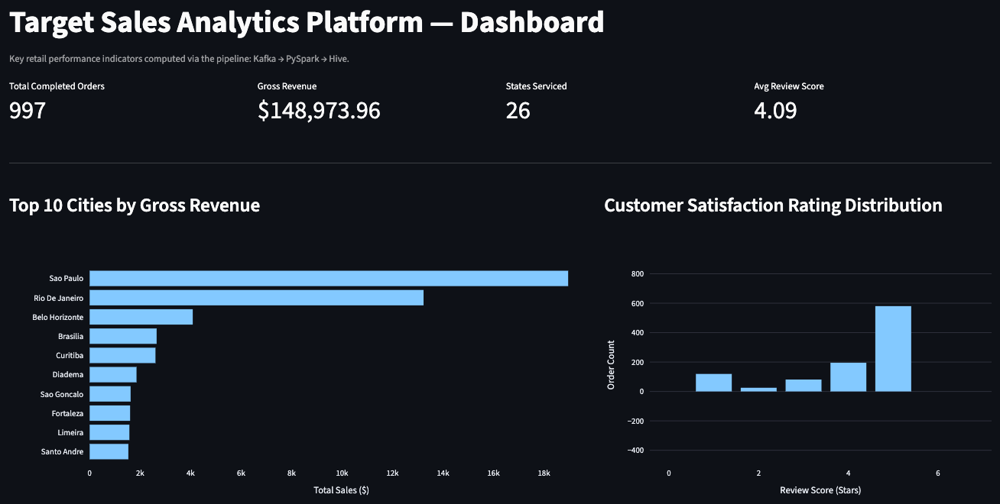

# Target Retail Transactions: Technical Analysis & Data Pipeline

[](requirements.txt)
[](docker-compose.yml)

A high-performance, end-to-end data pipeline that ingests retail transactions through Kafka, processes them in real time with PySpark Structured Streaming, and registers analytical database tables in a Hive Metastore lakehouse catalog. The processed datasets are served directly via an interactive Streamlit dashboard and an SQL query engine.

---

## 🖥️ Streamlit Interactive Dashboard

The results of the pipeline are served through a lightweight, cached **Streamlit Dashboard** built on pandas and Plotly. It reads the computed Gold Parquet tables directly from the host storage layer for sub-second page loads.




### Core Metrics Tracked:
- **Gross Revenue & Completed Orders:** Live transaction counts and total sales volume.
- **Top Cities by Revenue:** Horizontal bar chart highlighting high-value metropolitan regions.
- **Customer Satisfaction Rating Distribution:** Bimodal distribution chart representing customer ratings.
- **Delivery Timeline vs. Customer Satisfaction:** Correlation bar chart analyzing shipping SLAs against review scores.

To start the dashboard locally:
```bash
.venv/bin/streamlit run dashboard.py
```

---

## 🏗️ System Architecture

The data pipeline adopts a decoupled **transport, compute, and serving** pattern:

```mermaid
graph TD
    CSV[data/target_orders.csv] -->|producer.py| Kafka[Kafka topic: target_orders]
    Kafka -->|consumer.py <br> Structured Streaming| Spark[PySpark Structured Streaming]
    Spark -->|Parquet + Checkpoint| Bronze[Bronze Layer <br> Raw Ingest]
    Bronze -->|common.py clean()| Silver[Silver Layer <br> Cleaned & Enriched]
    Silver -->|transforms.py| Gold[Gold Layer <br> Analytical Aggregations]
    Gold -->|hive_loader.py| Hive[Hive Metastore <br> Database Catalog]
    Hive -->|query_hive.py| SQL[SQL Query Engine]
    Gold -->|dashboard.py| Streamlit[Interactive Streamlit Dashboard]
```

### Medallion Data Model
- **Bronze (Raw Ingest):** Immutable record of events arriving from Kafka. Implemented via Spark Structured Streaming with state checkpoints to guarantee fault tolerance and exactly-once semantics.
- **Silver (Cleaned & Enriched):** Cleaned, normalized, and typed record layer. Standardizes formatting issues (e.g., inconsistent city/state casing) and computes derived attributes (e.g., shipping and approval durations).
- **Gold (Aggregated Metrics):** Optimized, business-level aggregates (revenue, SLAs, correlations) saved in columnar Parquet format.

---

## 🚀 Quick Start (Dockerized Execution)

Run the entire pipeline—broker, event producer, structured streaming consumer, data profiling, transforms, and Hive registration—with no local dependencies:

```bash
docker compose up --build
```
*Ctrl-C or `docker compose down` to stop. Results land in `output/` on the host via bind mounts.*

### Query Results via SQL:
Execute queries inside the running container using the interactive SQL shell:
```bash
docker compose exec pipeline python3 src/processing/query_hive.py
```

---

## 🛠️ Native Installation (Local Execution)

If running directly on your host system:

### 1. Install Dependencies & Services:
```bash
# Set up Python virtual environment
python3 -m venv .venv && .venv/bin/pip install -r requirements.txt

# Install & start Kafka (requires Java 17/21 for Spark and Kafka)
brew install kafka && brew services start kafka
```

### 2. Run the Ingestion & Analytics Pipeline:
```bash
# Execute end-to-end bash runner
./run_pipeline.sh
```
*Use `./run_pipeline.sh --no-kafka` to run only the Spark and Hive stages using cached data.*

### 3. Open the Interactive SQL CLI:
```bash
.venv/bin/python src/processing/query_hive.py
```

---

## 📈 Key Technical Highlights & Performance Tuning

- **Structured Streaming Checkpoints:** The consumer ([consumer.py](file:///Users/vaishnavmaddi/Documents/Dataeng_casestudy/src/ingestion/consumer.py)) checkpoints offsets to disk. In the event of a crash, the pipeline resumes from the last processed partition state without duplicating or dropping transactions.
- **Partition Pruning:** Silver and Gold tables are partitioned by `customer_state` in the Hive metastore. When querying with state filters, Spark skips other subdirectories entirely, reducing I/O.
- **String Identifiers:** ZIP codes and other identifiers are explicitly typed as `StringType` instead of integer types, preventing data loss such as truncated leading zeros (`01040` $\rightarrow$ `1040`).
- **Coalesced Output Parts:** Gold tables are tiny aggregates, so the write layer applies `.coalesce(1)` to bundle files and eliminate the small-files problem for consumption layers.
- **Shuffle Optimization:** Optimized Spark's shuffle partition configurations down from the default $200$ to $8$ to match CPU core layouts and prevent scheduling overhead.

---

## 🧪 Testing & Code Quality

Run tests and style linters:
```bash
.venv/bin/pip install pytest ruff
.venv/bin/pytest tests/ -v
.venv/bin/ruff check src/ tests/
```
The test suite ensures regression safety for critical data formatting routines (such as casing, type casting, and schema validation).
